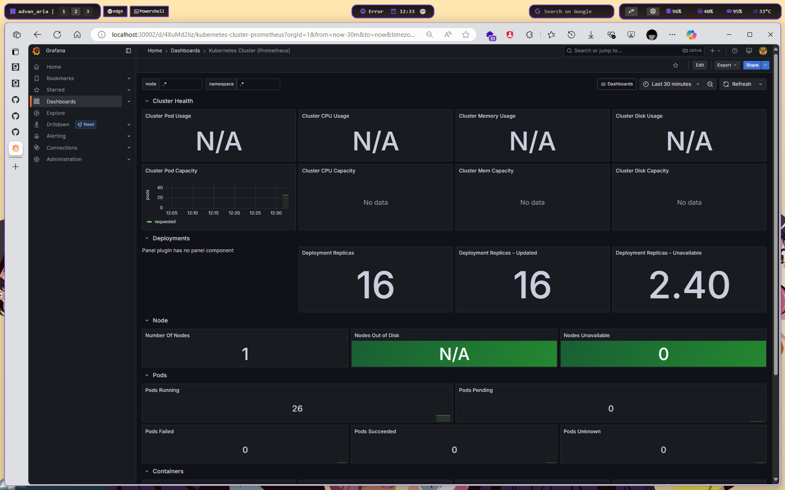
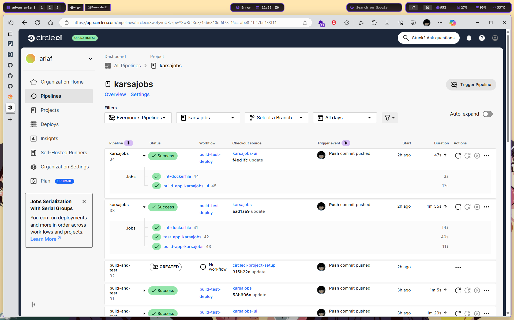

# Submission 2 - Microservices dengan Kubernetes

## Deskripsi Proyek
Proyek ini adalah implementasi aplikasi web menggunakan Kubernetes yang terdiri dari:
- Frontend service (React)
- Backend service (Go)
- MongoDB database
- Monitoring stack (Prometheus & Grafana)

## URL Repository
- [Repository Submission](https://github.com/ariafatah0711/dicoding_8/tree/main/submission_2)
- [Frontend Repository](https://github.com/ariafatah0711/a433-microservices/tree/karsajobs-ui)
- [Backend Repository](https://github.com/ariafatah0711/a433-microservices/tree/karsajobs)

## Screenshot Implementasi



## Prasyarat
- Kubernetes cluster (minikube/kind)
- Helm package manager
- kubectl CLI
- Docker
- GitHub account (untuk CI/CD)

## Struktur Proyek
```
submission_2/
├── kubernetes/           # Manifest Kubernetes
│   ├── mongodb/         # Manifest MongoDB
│   ├── backend/         # Manifest Backend
│   └── frontend/        # Manifest Frontend
├── monitoring/           # Konfigurasi monitoring
├── images/              # Screenshot dan dokumentasi visual
│   └── README/         # Screenshot hasil implementasi
├── link.txt            # Link container images
└── monitoring.txt      # Output monitoring
```

## Teknologi yang Digunakan
- **Container Registry**: GitHub Packages
- **CI/CD**: CircleCI
- **Container Runtime**: Docker
- **Orchestration**: Kubernetes
- **Monitoring**: Prometheus & Grafana
- **Backend**: Go
- **Frontend**: React
- **Database**: MongoDB

## Container Images
Container images tersedia di GitHub Packages:
- Backend: `ghcr.io/ariafatah0711/karsajobs`
- Frontend: `ghcr.io/ariafatah0711/karsajobs-ui`

## Continuous Integration/Continuous Deployment (CI/CD)
Proyek ini menggunakan CircleCI untuk otomatisasi build dan deployment:

### Branch karsajobs (Backend)
1. Lint Dockerfile
2. Run Tests
3. Build & Push Container

### Branch karsajobs-ui (Frontend)
1. Lint Dockerfile
2. Build & Push Container

## Instalasi karsajobs
### 1. Setup Namespace
```bash
kubectl create namespace submission2
```

### 2. Deploy Aplikasi
```bash
# Deploy MongoDB
kubectl apply -f kubernetes/mongodb/

# Deploy Backend
kubectl apply -f kubernetes/backend/

# Deploy Frontend
kubectl apply -f kubernetes/frontend/
```

### 3. Verifikasi Deployment
```bash
# Cek status resources
kubectl get pv,pvc,secret,configmap -o wide
kubectl get all -o wide -n submission2
```

## Instalasi Monitoring
### 1. Setup Namespace
```bash
kubectl create namespace monitoring
```

### 2. Instalasi Prometheus
```bash
helm repo add prometheus-community https://prometheus-community.github.io/helm-charts
helm install prometheus prometheus-community/prometheus -n monitoring
```

### 3. Instalasi Grafana
```bash
helm repo add grafana https://grafana.github.io/helm-charts

# without dashboard after create
helm install grafana grafana/grafana --namespace monitoring \
  --set adminPassword='admin' \
  --set service.type=NodePort

# with dashboard after create
helm install grafana grafana/grafana -f monitoring/grafana-values.yaml -n monitoring
```

### 4. Verifikasi Monitoring
```bash
kubectl get all -n monitoring
```

### Konfigurasi Grafana
1. Akses Grafana melalui port-forward (jika tidak bisa mengakses lewat Service NodePort 30002):
```bash
kubectl port-forward svc/grafana -n monitoring 30003:80
```

2. Login dengan kredensial:
   - Username: admin
   - Password: admin

3. Tambahkan data source Prometheus (jika belum ada data source prometheus nya):
   - URL: http://prometheus-server.monitoring.svc.cluster.local

4. Import dashboard (jika belum ada dashboard):
   - Template ID: 6417 (Kubernetes Cluster Prometheus)
   - URL: https://grafana.com/grafana/dashboards/6417-kubernetes-cluster-prometheus/

## Akses Aplikasi
- Frontend: http://localhost:30000
- Backend: http://localhost:30001
- Grafana Dashboard: http://localhost:30002 atau http://localhost:30003 (jika menggunakan port-forward)

## Cleanup
Untuk menghapus semua resources:
```bash
# Hapus aplikasi
kubectl delete -f kubernetes/mongodb/
kubectl delete -f kubernetes/backend/
kubectl delete -f kubernetes/frontend/

# Hapus namespace
kubectl delete namespace submission2

# Hapus monitoring stack
kubectl delete namespace monitoring
```

## Referensi
- [Grafana Helm Charts](https://grafana.github.io/helm-charts/)
- [Kubernetes Cluster Prometheus Dashboard](https://grafana.com/grafana/dashboards/6417-kubernetes-cluster-prometheus/)
- [CircleCI Documentation](https://circleci.com/docs/)